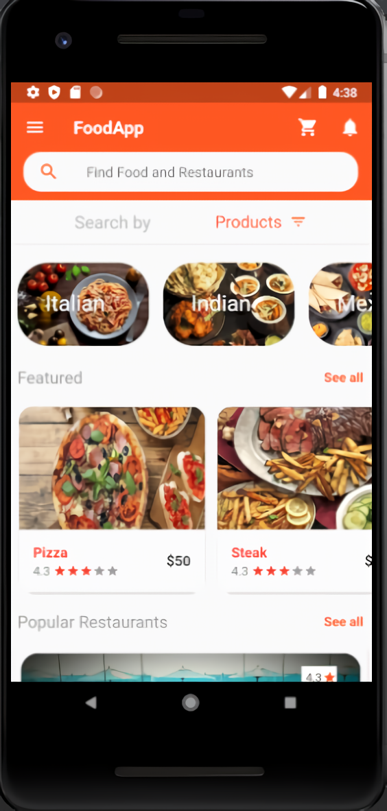
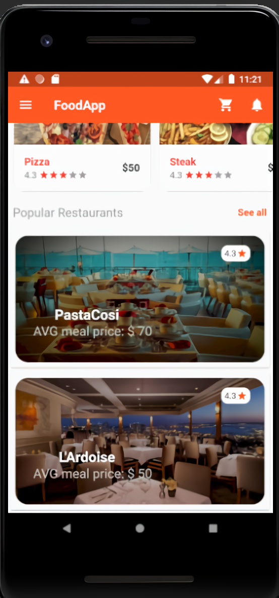
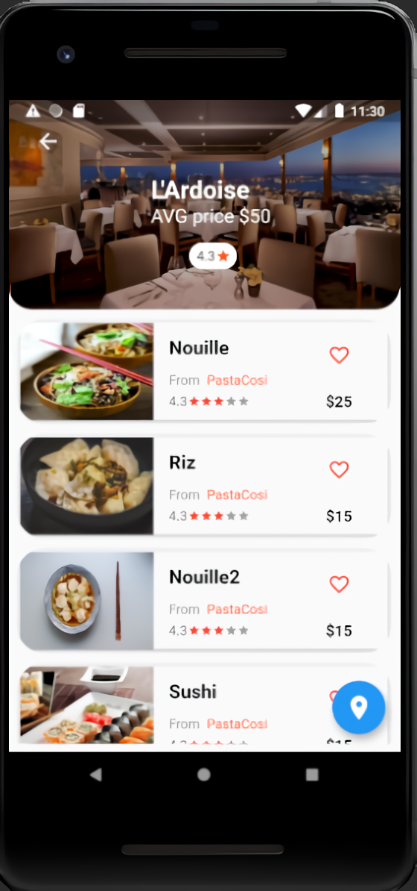
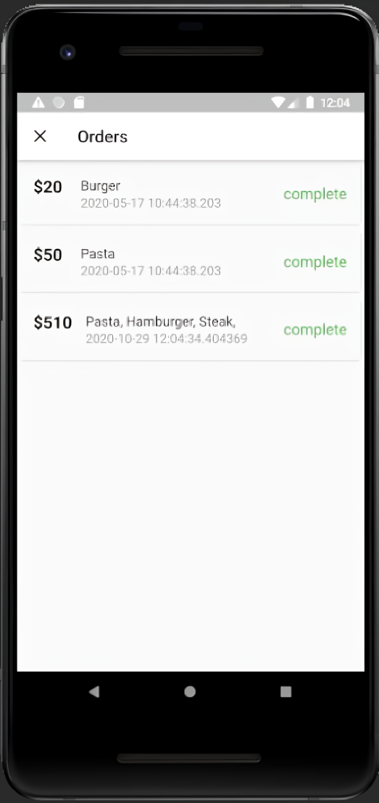
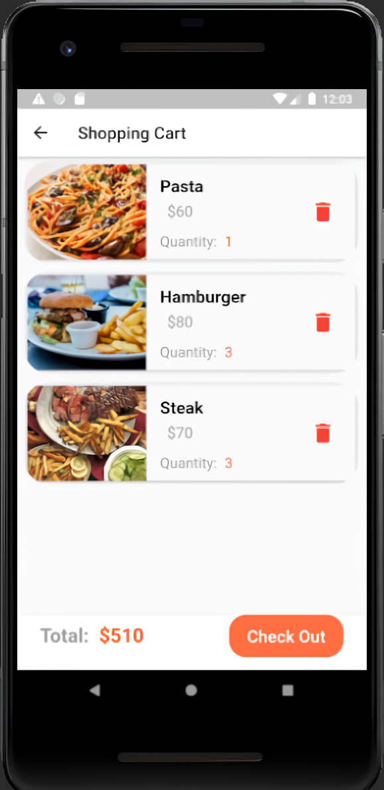
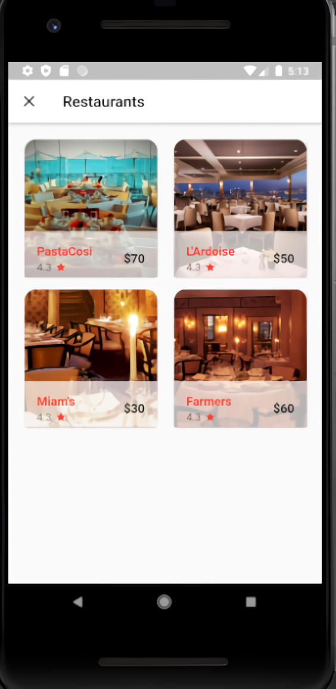

# FoodApp

Embark into a flavorful journey with a mobile app I crafted using Flutter & Dart. Born from my personal coding adventures, as I first delved into the world of Flutter, 
this app reshapes how we explore culinary delights. From discovering top spots to browsing delicious menus, it's your go-to destination for dining excellence.
#learnByCoding

## UIs

  

    <table>
      <tr>
        <td></td>
        <td></td>
        <td></td>
      </tr>
   </table>
  

  

    <table>
      <tr>
        <td></td>
        <td></td>
        <td></td>
      </tr>
   </table>
  

  

    <table>
      <tr>
        <td></td>
        <td></td>
        <td></td>
      </tr>
   </table>
  

  

    <table>
      <tr>
        <td></td>
        <td></td>
        <td></td>
      </tr>
   </table>
  

## Getting Started
For help getting started with Flutter, view our
[online documentation](https://flutter.dev/docs), which offers tutorials,
samples, guidance on mobile development, and a full API reference.

